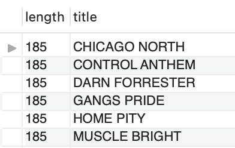
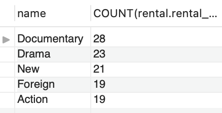
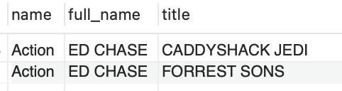
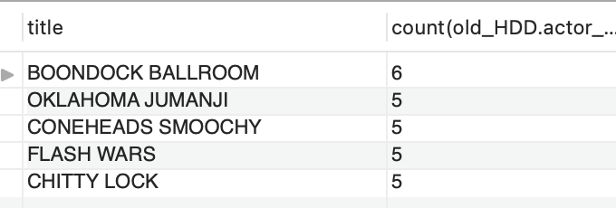
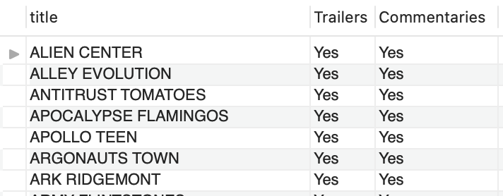

# Database Project II

## Objetivo
En este proyecto, vamos a manipular y limpiar un conjunto de datos para posteriormente exportarlo a MySQL, donde crearemos una una base de datos son sus correspondientes relaciones lógicas y analizaremos y sacaremos diferentes conclusiones. 

## Intro
La finalidad del ejercicio es poner en práctica todo lo aprendido sobre **exportación y visualización de datos en SQL.** Además ejecutaremos diferentes queries para sacar cierta información.

Para ello, hemos tenido que importar siete archivos de datos, que contiene registros sobre una tienda de alquiler de peliculas, explorar y limpiar esos arhivos para luego trabajar con ellos en MySQL

## Requisitos:
1. Cargar datos
2. Limpiar datos
3. Crear DB
4. Crear 10 querys SQL

## Procedimiento:

**1. Exploración y limpieza:**

1.1 Realizamos una exploración del tamaño y calidad de los datos.

1.2 Así mismo, recorreremos el archivo por columnas, evaluando la mejor manera de limpiar y extraer la mayor cantidad de datos para nuestra visualización. 

1.3 Comprobamos si hay filas que tengan valores nulos en todas las columnas y comprobamos también los duplicados (no hay), ya que nos puede influir a la hora de hacer el análisis. 

1.4 Eliminamos la columna original_languaje_id porque vemos que esa columna tiene el 100% de los valores nulos.

1.5 En las columnas last_update eliminamos la hora para quedarnos solamente con la fecha

1.6 La columna special_features tiene 4 valores únicos asi que eliminaremos esa columna y creamos 4 nuevas columnas:
    -Behind_the_Scenes
    -Commentaries
    -Deleted_Scenes
    -Trailers
    Posteriormente, creamos una función donde nos diga si tiene o no esas características.

1.7 Creamos una nueva columna en la tabla old_HDD donde nos traiga el actor_id de la tabla ACTOR para poder luego crear las relaciones entre tablas en MySQL. También concatenamos las columnas first y last name en una nueva columna llamada full_name.

**2. Exportación, visualización y análisis de datos en MySQL:**

Una vez que hemos manipulado y limpiado el archivo, procedemos a exportarlo a SQL donde realizaremos las relaciones y añadiremos las categorias 'primary key' y 'foreign key' en cada una de las tablas.

Una vez realizada esta parte crearemos las queries para poder sacar la información que más nos interese para nuestro análisis. 
A continuación vemos algunas de las queries que más información nos puede aportar.

Aquellas películas que duren más de 120 minutos:

Los géneros de películas más alquilados:

Películas de acción donde salga 'ED CHASE'

Las cinco películas que más actores tienen

Aquellas películas que tengan trailer y también tengan comentarios

